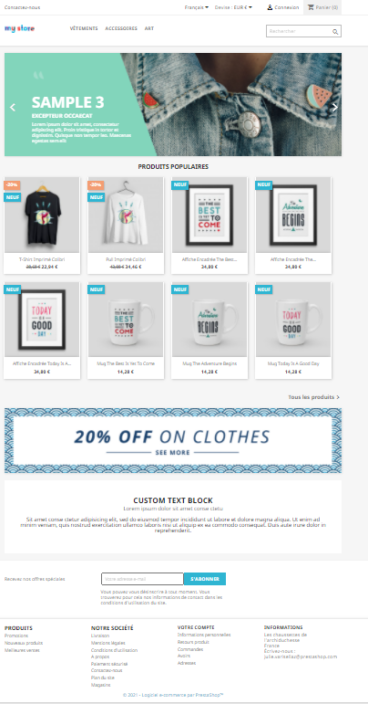

# Navegando por la oficina principal

:flecha\_derecha:[Contribuir](https://prestashop.gitbook.io/howtocontribute/)

La recepción es la parte visible de su sitio. Es lo que los clientes ven cuando navegan por tu tienda y durante todo el proceso de compra.

Como comerciante, debes conocer tu front office como la palma de tu mano, no sólo porque te debes a ti mismo conocer tu tienda por dentro y por fuera, sino también porque necesitas entender a qué se enfrentan tus clientes, el número de páginas y clics que pasan durante una sesión de compra típica, dónde pueden quedarse estancados y cómo ayudarte, etc.

Aunque creas que conoces tu front office de memoria, no olvides volver de vez en cuando como si fueras un usuario que visita el sitio por primera vez. Navega por tu tienda, compra un producto, contacta con el servicio de atención al cliente... ¡ponte en el lugar de tus clientes! Podrías hacer algunos descubrimientos y anotar algunos puntos para mejorar.

Tenga en cuenta que esta página de documentación se basará únicamente en el tema, la configuración y los módulos predeterminados. De hecho, habilitar otros módulos o utilizar otro tema podría cambiar drásticamente la experiencia de compra.


Si desea cambiar su tema, puede elegir uno entre la gran variedad de temas disponibles en [PrestaShop Addons](https://addons.prestashop.com/en/3-templates-prestashop).


## El tema predeterminado

PrestaShop viene con un tema predeterminado que utiliza un diseño simple, limpio, gris y blanco. Este minimalismo lo hace adecuado para casi cualquier industria. Fue diseñado para ser fácil de navegar, ergonómico, compatible con estándares y adaptado a todos los tamaños de pantalla y dispositivos.

Si instaló PrestaShop con sus datos de muestra, verá productos de ropa y accesorios para el hogar.&#x20;

## Navegando por la tienda

El encabezado es una barra delgada de contenido en la parte superior de la página, accesible desde todas las páginas de la oficina principal.&#x20;

El encabezado está dividido en dos partes.&#x20;

La parte superior del encabezado contiene:

 (1).png>)

* **Un enlace a la página de contacto**&#x20;
* **Un selector de idioma:** si hay más de un idioma disponible en la tienda, los clientes pueden elegir en qué idioma quieren ver la tienda.&#x20;
* **Un selector de moneda:** si hay más de una moneda disponible en la tienda, los clientes pueden elegir en qué moneda quieren ver los precios de los productos mostrados. Esto puede resultar muy útil a la hora de comparar precios con otras tiendas internacionales.&#x20;
* **Un enlace a la página de autenticación:** una vez que inician sesión, los clientes tienen acceso a su cuenta y aparece un enlace "Cerrar sesión" junto a su nombre.
* **Un enlace al carrito de compras del cliente:** de un vistazo, los clientes pueden ver cuántos artículos hay en su carrito. También podrá pulsar en el botón “Carrito de la compra” para acceder al contenido del carrito y finalizar su pedido.

La parte inferior del encabezado es más grande y contiene:

 (1) (1).png>)

* **El logotipo de la tienda:** al hacer clic en este logotipo, los clientes serán redirigidos automáticamente a la página de inicio de la tienda. ¡No olvides cambiar el logotipo predeterminado agregando el tuyo propio desde la página Diseño > Tema y logotipo de la oficina administrativa!
* **El menú:** de forma predeterminada, se muestran las categorías "Ropa", "Accesorios" y "Arte", y las subcategorías aparecen al pasar el mouse. Para personalizar el menú con tus propias categorías, debes configurar el módulo "Menú Principal".&#x20;
* **La barra de búsqueda:** esencial para facilitar la búsqueda en tu tienda, la barra de búsqueda permite a los clientes encontrar rápidamente los artículos de su elección gracias a las palabras clave.


¡La opción de búsqueda aproximada ahora tiene en cuenta posibles errores tipográficos en las entradas que buscan sus visitantes!&#x20;


### **La sección central**

La página de inicio predeterminada ofrece al cliente una visión amplia de la tienda y sus posibilidades. ¿Qué quieres mostrar a tus clientes?&#x20;

En la parte superior de la página, hay un control deslizante de imágenes: se desplazan tres imágenes. Puede configurar este control deslizante con la ayuda del módulo "Control deslizante de imagen" para resaltar sus nuevas colecciones, promociones, etc.

Justo debajo del control deslizante de imágenes se muestran los productos populares de su tienda.

También puedes personalizar un banner o agregar un bloque de texto. No dude en echar un vistazo a la documentación dedicada para aprender cómo [configurar las páginas de front office de su tienda.](improving-shop/customizing-store-design/theme-and-logo.md#pages-configuration)

### El pie de página

El pie de página se divide en dos partes.

 (1).png>)

:arrow\_right:La parte superior del pie de página contiene un bloque de suscripción para su boletín informativo, lo que permite a los clientes recibir ofertas especiales. Este formulario de suscripción se gestiona mediante el módulo "Suscripción a newsletter".

 (1).png>)


Tenga en cuenta que el envío del boletín es su responsabilidad. Con el módulo "Newsletter" puedes generar un archivo .csv que contiene todos los clientes registrados y sus correos electrónicos. Luego podrá importar este archivo a cualquier sistema de correo electrónico.


La parte inferior del pie de página contiene 4 bloques que dan acceso a páginas muy útiles para tus clientes:



**El bloque "Productos" permite un acceso rápido a las siguientes páginas:**&#x20;

* Promociones&#x20;
* Nuevos productos
* Mejores ventas



**El bloque "Nuestra empresa" permite un acceso rápido a las siguientes** **páginas:**&#x20;

* Entrega&#x20;
* Aviso legal&#x20;
* Términos y condiciones de uso&#x20;
* Sobre nosotros&#x20;
* Pago seguro
* Contáctenos&#x20;
* Mapa del sitio&#x20;
* Víveres



**El bloque "Tu cuenta" redirige a las páginas principales de la cuenta del cliente (o a la página de autenticación, si el cliente no ha iniciado sesión):**

* información personal
* Órdenes
* recibos de crédito
* Direcciones



**El bloque "Información de la tienda" contiene toda la información sobre tu tienda:**

* El nombre de la tienda.
* la dirección
* el numero de telefono
* el correo electrónico



### Las páginas de categorías

#### La columna izquierda

 (1) (1).png>)

Una categoría es una forma jerárquica de clasificar productos: puede contener un número ilimitado de subcategorías, lo que le permite cambiar fácilmente de listados generales a productos más específicos siguiendo una ruta lógica.&#x20;

Una tienda PrestaShop puede tener tantas categorías y subcategorías como sea necesario, con un número infinito de productos en un nivel de categoría determinado.&#x20;

En las páginas de categorías, en la columna de la izquierda, los clientes pueden ver en qué categoría o subcategoría se encuentra el producto.&#x20;

Tenga en cuenta que todas las categorías son subcategorías de la categoría raíz, "Inicio". Puedes configurar las categorías desde tu back office, en la página Catálogo > Categorías.


[administrando-categorías.md](selling/managing-catalog/managing-categories.md)


#### El bloque "Filtrar por"

Filtrar su búsqueda permite a los clientes encontrar más rápido el producto que buscan. En la columna izquierda de una página de categorías, es posible refinar una búsqueda filtrándola por atributos, características o rango de precios. El bloque "Filtrar por" se puede configurar a través del módulo "Búsqueda por facetas".

#### El encabezado de categoría

 (1).png>)

Las categorías tienen una imagen de encabezado y una descripción. Puede configurar este encabezado desde su back office en la página Catálogo > Categorías.&#x20;

### Listados de productos&#x20;

Todas las listas de productos son idénticas en PrestaShop, independientemente de la naturaleza de la página en cuestión (nuevos productos, más vendidos, páginas de categorías, etc.). Los productos están organizados en una cuadrícula, con:

* Una imagen en miniatura&#x20;
* Banderas promocionales o de estado en la parte superior izquierda de la imagen&#x20;
* El nombre del producto
* El precio del producto.

.png>)

Esta presentación en cuadrícula permite a los clientes ver de un vistazo la información principal del producto, agilizando así el proceso de toma de decisiones.

Al pasar el mouse, los clientes pueden hacer clic en la lupa para acceder a una descripción general rápida del producto. Entonces tendrá acceso, además de la información anteriormente indicada, a la descripción del producto, y podrá añadir el producto a su carrito tras haber seleccionado los atributos (si los hubiera) e introducido la cantidad deseada.

 (1).png>)

#### Clasificación de productos

Los productos se pueden ordenar por precio (de mayor a menor o de menor a mayor), nombre (de A a Z o de Z a A) o por relevancia.

### La pagina del producto

 (1).png>)

La página del producto presenta la información que ingresó desde la página Catálogo > Productos de su back office. Dependiendo del tema utilizado, la página de un producto puede ser muy completa, con información detallada, o simplemente presentar la información esencial.

El tema predeterminado le permite mostrar una o más imágenes de productos. Junto a las imágenes aparece otra información sobre el producto: el nombre del producto, el precio y posibles descuentos, y un breve resumen.&#x20;

Justo debajo de esta información del producto, los clientes pueden elegir entre las combinaciones disponibles (si las hay) y seleccionar la cantidad deseada.&#x20;

Debajo del botón "Añadir al carrito", elementos de tranquilidad informan a tus clientes sobre las diferentes políticas de pago, entrega, devoluciones, etc. Para modificar esta información debes configurar el módulo "Tranquilidad".&#x20;

Finalmente, en la parte inferior derecha de la página, un bloque muestra dos pestañas:&#x20;

**Descripción:** aquí aparece una descripción completa del producto, tal como fue ingresada en el back office.&#x20;

**Detalles del producto:** esta pestaña solo aparece si se han asociado características al producto desde el back office, por ejemplo, la marca o la composición.&#x20;

Para obtener más información sobre la configuración de la página del producto, visite la [página de documentación dedicada.](selling/managing-catalog/managing-products.md)

### el carro

Desde el encabezado, los clientes pueden ver cuántos artículos hay en su carrito. Al hacer clic en el botón "Carrito", el cliente puede acceder al contenido del carrito y finalizar su pedido.

 (2).png>)

Se muestra un resumen del contenido del carrito. Después de comprobar que el contenido del pedido es correcto, el cliente puede hacer clic en el botón "Continuar con el pago". Luego son redirigidos a la página de pago.

## Comprar un producto&#x20;

Una vez que el carrito de compras esté lleno con todos los artículos deseados y se inicie el proceso de pedido, el cliente deberá validar una serie de pasos hasta la validación de su pedido.&#x20;

PrestaShop se asegura de que el proceso de compra sea rápido y eficiente. Este proceso se lleva a cabo en 5 pasos:&#x20;

**Información personal:** si el cliente no está conectado, puede elegir realizar su pedido como invitado, crear una cuenta o iniciar sesión.

**Direcciones:** Si no se ha registrado ninguna dirección previamente, el cliente deberá rellenar el formulario de creación de dirección. En caso contrario, podrán seleccionar directamente la dirección a la que desean que se les entregue. Si la dirección de entrega y la dirección de facturación son diferentes, el cliente puede desmarcar la casilla "Usar la misma dirección para facturación" y seleccionar una dirección de las ya ingresadas o ingresar una nueva.

**Método de envío:** aquí es donde el cliente deberá elegir entre las opciones de envío y embalaje. Dependiendo de lo que ofrece la tienda, el cliente puede elegir un paquete reciclado y/o papel de regalo para su pedido. El cliente puede aprovechar este paso si desea compartir un mensaje sobre su pedido.

**Pago:** el cliente puede elegir varias opciones de pago dependiendo de lo que haya configurado el comerciante. El cliente hace clic en el método elegido y, dependiendo de él, es enviado al administrador del proveedor externo o a una página en PrestaShop donde puede ingresar los detalles necesarios. PrestaShop facilita la adición de métodos de pago como PayPal, Hipay u otros proveedores externos. Vaya a la página "Módulos" del back office para descubrir todos los módulos de pago disponibles de forma nativa y descubra muchos otros en el mercado de complementos.

**Validación y resumen:** una vez que el cliente ha validado todo y aceptado las condiciones generales de venta, su pedido queda confirmado y puede acceder al resumen de su pedido. Dependiendo del método de pago elegido, se podrá enviar alguna información final al cliente, con una notificación de la confirmación por correo electrónico y un enlace a la página de soporte. El cliente deberá hacer clic en "Confirmo mi pedido" para poder validarlo.

## Crear una cuenta de cliente


¡PrestaShop permite a los visitantes de su tienda crear una cuenta de forma sencilla y rápida!


Al hacer clic en "Iniciar sesión" en el encabezado, los visitantes son redirigidos a una página de autenticación. Si no tienen una cuenta, pueden crear una desde la misma página.

El formulario de creación de cuenta se compone de dos partes:&#x20;

**Información personal:** el cliente indica su información personal (nombre, apellidos, correo electrónico, contraseña y fecha de nacimiento). Esta funcionalidad es administrada por el módulo "Enlace de inicio de sesión del cliente".&#x20;

**Suscripciones:** los clientes pueden optar por suscribirse a su boletín y recibir o no las ofertas de su socio. Asegúrate de mostrar estos campos solo si realmente envías este tipo de contenido.&#x20;

Una vez registrados, los clientes acceden a su cuenta de cliente, donde hay muchas opciones disponibles. En particular, pueden agregar una primera dirección: su dirección predeterminada, ¡pero pueden tener más! Si el cliente tiene una sola dirección registrada, se utilizará como dirección de envío y facturación. Durante el proceso de pago, el cliente siempre puede optar por utilizar una dirección diferente.


El pago como invitado (función disponible en la página Parámetros de la tienda > Configuración de pedidos) permite a los visitantes comprar productos sin crear una cuenta. Aún se requiere información esencial de entrega y pago, pero el cliente nunca tendrá que crear una contraseña.

