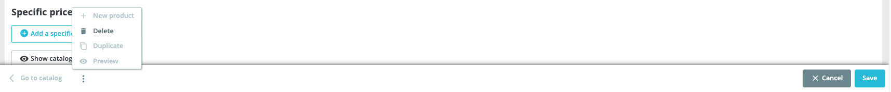

# Nueva página de producto (PrestaShop 8.1)


Para utilizar la página de nuevo producto, debe habilitarla en la página [Funciones nuevas y experimentales](../../configuring-shop/advanced-parameters/experimental-features.md) en PrestaShop 8.1:


<figure><figcaption></figcaption></figure>

## Agregar un nuevo producto

Para agregar un nuevo producto a su catálogo, haga clic en **"Agregar nuevo producto"** en la página **Catálogo > Productos**.

Se abre una nueva ventana que muestra los **4 tipos diferentes de productos** que puedes agregar a tu tienda. Al seleccionar un tipo específico de producto, se cambiarán las diferentes pestañas que se muestran en la página de creación del producto:

<figure><figcaption></figcaption></figure>

* **Producto estándar:** _Un producto físico que debe enviarse._ Se mostrará la pestaña **Existencias**. Tenga en cuenta que **no puede agregar combinaciones a un producto estándar**.
* **Producto con combinaciones:** _Un producto con diferentes variaciones (talla, color, etc.) entre el cual los clientes pueden elegir._ Se mostrará la pestaña **Combinaciones** y desaparecerá la pestaña Existencias.&#x20;
* **Paquete de productos:** _Una colección de productos de tu catálogo._ Se mostrará la pestaña **Paquete** y desaparecerán las pestañas Combinaciones y Existencias.&#x20;
* **Producto virtual:** _Un producto intangible que no requiere envío. También puedes agregar un archivo descargable._ Se mostrará la pestaña **Producto virtual** y las pestañas Combinaciones, Existencias y Paquete desaparecerán.

### Cambiar el tipo de producto

Si ha seleccionado el tipo de producto incorrecto, puede cambiar rápidamente su tipo:

* Haga clic en **tipo de producto** (debajo del campo de nombre del producto)
* Se muestra una ventana que le pide que **seleccione el nuevo tipo de producto**:

<figure><figcaption></figcaption></figure>


Tenga en cuenta que al cambiar su tipo de producto, **se eliminarán todas las combinaciones** y **se restablecerán sus existencias.**


<figure><figcaption></figcaption></figure>

## Creando un producto con combinaciones.

En PrestaShop 8.1, se ha rediseñado la página de combinación. Ahora aparece un modo de generación de combinaciones al hacer clic en la pestaña "**Combinaciones" > "Administrar combinaciones de productos"**.

Para seleccionar valores individuales, **haga clic en un atributo** para expandirlo y **seleccione los valores** que desea agregar a su producto.

<figure><figcaption></figcaption></figure>

Para seleccionar todas las combinaciones para cada atributo, **haga clic en la casilla de verificación** a la izquierda de los atributos elegidos:

<figure><figcaption></figcaption></figure>


También puede buscar manualmente un atributo utilizando el campo **"Buscar atributos..."** para encontrar atributos específicos.&#x20;

 (1).png>)

Esta función puede resultar útil si su catálogo tiene muchos atributos diferentes.


## Generando combinaciones

Si seleccionas todos los valores para los atributos "Tamaño" y "Color", podrás generar hasta 56 combinaciones en tu catálogo. Una vez que haya seleccionado sus atributos, haga clic en **"Generar X combinaciones"** para generar combinaciones.

Al utilizar el **modo multitienda**, puedes generar atributos para todas las tiendas marcando la opción dedicada **"Generar combinaciones para todas las tiendas"**, al lado del botón "Cancelar":

<figure><figcaption></figcaption></figure>

## Gestionar combinaciones

### Usar filtros combinados

PrestaShop 8.1 introduce filtros de combinaciones en la página **"Combinaciones" > "Administrar combinaciones de productos"**, lo que le permite administrar rápidamente combinaciones en su tienda:

<figure><figcaption></figcaption></figure>

## Acciones masivas


Puede utilizar acciones masivas para eliminar o editar rápidamente algunas o todas las combinaciones de productos a la vez.&#x20;


Para seleccionar varios elementos a la vez, puede usar filtros y seleccionar los atributos que desea editar o eliminar. También puede utilizar la lista de marcas de verificación en el lado izquierdo de la tabla de productos para seleccionar manualmente los artículos elegidos.

### Editar atributos de forma masiva

Para editar un campo de forma masiva, **seleccione las combinaciones que desea editar** y haga clic en el botón **"Acciones masivas"**:

<figure><figcaption></figcaption></figure>

Luego, haga clic en la lista desplegable para cada categoría (por ejemplo, "Precio minorista") y seleccione el elemento que desea editar.

Luego puede habilitar el campo usando el botón deslizante (activar/desactivar) y **escribir el valor deseado.**

<figure><figcaption></figcaption></figure>


De forma predeterminada, el valor establecido para **cada campo es 0.**

Para restablecer un campo, puede **alternarlo** y establecer manualmente su **valor nuevamente en 0.**


De esta manera, los cambios solo se aplicarán a **tus combinaciones seleccionadas.**

### Eliminar atributos de forma masiva

Puede eliminar atributos de forma masiva seleccionando varios elementos a la vez a través de filtros o marcas de verificación, luego haga clic en **"Acciones masivas" > "Eliminar combinaciones X"**&#x20;

 (1).png>)

Se muestra una ventana pidiéndole que **confirme su elección.**

## Paginación


La nueva página del producto ahora incluye una función de paginación. Le permite navegar fácilmente por los productos de su tienda y mostrar hasta 100 artículos por página.


<figure><figcaption></figcaption></figure>

Con la implementación de la función de paginación, el tiempo de carga de la página se ha reducido considerablemente. Esto significa que puedes tener tantas combinaciones como quieras y no tienes que preocuparte por el rendimiento de tu back office.

## Precios

<figure><figcaption></figcaption></figure>

### Precio al por menor

La pestaña Precios ahora incluye una calculadora de impuestos simple, que le permite calcular rápida y claramente su precio minorista con impuestos incluidos.

Para agregar una nueva regla fiscal a su precio minorista:

* Ingrese su **precio de venta inicial (sin impuestos)**,&#x20;
* Luego elija la **regla fiscal que desea aplicar** de la lista.&#x20;

El precio de venta al público del producto (impuestos incluidos) se calculará automáticamente para su producto.

<figure><figcaption></figcaption></figure>


**No puedo encontrar una norma fiscal específica en la lista.**

Puede agregar reglas impositivas para países específicos haciendo clic en "**Administrar reglas impositivas"** para agregar manualmente una regla impositiva.

También puede [importar los impuestos de un nuevo paquete de localización](../../improving-shop/going-international/localization/localization-settings.md#localizationsettings-importalocalizationpack) desde la página [Localización](../../improving-shop/going-international/localization/)]:

 (1).png>)


### Resumen

Ahora se muestra un resumen del costo de su producto para que pueda verificar el costo y el precio de su producto en detalle de un vistazo.

<figure><figcaption></figcaption></figure>

Como recordatorio, el margen se calcula así:

<figure><figcaption></figcaption></figure>

### Mostrando el precio de venta por unidad

Conocer el precio minorista unitario es útil cuando se venden artículos que deben venderse por kilo o litro o cualquier otra unidad.&#x20;

Por ejemplo, si vendes caramelos por kilo en tu tienda, puedes especificar el **precio por kilo** y se mostrará en tu resumen, debajo del precio con impuestos incluidos y excluidos.

Active la función **"Mostrar precio minorista por unidad"** para mostrar el precio minorista por unidad en el resumen.

<figure><figcaption></figcaption></figure>

## Gestión de imágenes

### Reemplazo de una imagen

Ahora puede reemplazar la imagen de un producto. Simplemente seleccione la imagen que desea reemplazar y haga clic en el botón **"Reemplazar selección"**. Seleccione una imagen en su computadora y **asegúrese de guardar los cambios.**

<figure><figcaption></figcaption></figure>

### Reemplazo de imágenes en masa

Ahora es posible reemplazar una imagen de producto de forma masiva. Ya no necesita preocuparse por perder datos y enlaces de imágenes.

**Para reemplazar imágenes de forma masiva,**

* **Selecciona las combinaciones** que deseas editar,&#x20;
* Haga clic en el botón **"Acciones masivas"** y seleccione **"Editar combinaciones X"**
* Vaya al atributo **"Imágenes"** y **Alterne la función** para habilitarla.

Ahora puedes **seleccionar la imagen** que deseas asociar con tus combinaciones.

<figure><figcaption></figcaption></figure>

### Eliminar imágenes de forma masiva

Ahora es posible eliminar imágenes de productos de forma masiva.

Para hacerlo, seleccione las imágenes que desea eliminar y haga clic en el botón **"Eliminar selección"**:

<figure><figcaption></figcaption></figure>

## Cepo

#### Editar cantidad

Se ha implementado un nuevo sistema de stock. Para administrar sus existencias, simplemente **agregue un número positivo** o **reste un número negativo** en el campo de cantidad de existencias para actualizar sus existencias:

<figure><figcaption></figcaption></figure>


Los clientes a veces compran productos mientras usted actualiza sus existencias. Ahora se evitará un cálculo de stock incorrecto ya que sólo podrás actualizar tus stocks sumando o restando productos. De esta forma, podrás asegurar una gestión correcta y fiable del stock en tu tienda.


#### Movimientos bursátiles recientes

Para ver mejor sus acciones, se muestra una vista previa de los últimos 5 movimientos de acciones en la pestaña **"Movimientos de acciones recientes"**.&#x20;

<figure><figcaption></figcaption></figure>

Estos movimientos de stock también incluyen movimientos de stock de pedidos (las ventas y devoluciones de productos entre 2 movimientos de stock). &#x20;

El movimiento de stock de los pedidos de los clientes ahora se reagrupa para tener un mejor resumen de sus stocks.&#x20;

<figure><figcaption></figcaption></figure>

## Encabezamiento

El encabezado ahora resume todo lo que necesita saber sobre sus productos (tipos, referencias, stock, impuestos, etc.). Puede encontrar fácilmente información importante sobre su producto de un vistazo.

#### Indicador de color

Tres colores ahora indican el estado de su stock:

* **Verde "en stock":** cuando su stock es superior al stock bajo establecido.
* **Amarillo "stock bajo":** cuando el stock es igual o inferior al stock bajo establecido&#x20;
* **Rojo "agotado":** cuando el stock es inferior o igual a 0.

<figure><figcaption></figcaption></figure>

## Pie de página

#### Nueva redacción

Se ha mejorado la redacción del pie de página para mayor claridad. El botón guardar ahora tiene dos estados:

* **Guardar:** Guarda tu producto al crearlo o cuando el producto está fuera de línea (no publicado) en tu tienda.

<figure><figcaption></figcaption></figure>

* **Guardar y publicar:** Guarda tu producto y lo publica en tu tienda.&#x20;

<figure><figcaption></figcaption></figure>

Esto le ayuda a comprender mejor si sus cambios están activos en su tienda o no.

### Pie de página dinámico

El pie de página ahora es **dinámico y reacciona a tus acciones.**&#x20;

Las modificaciones se pueden **cancelar, obtener una vista previa, guardar o publicar**:

<figure><figcaption></figcaption></figure>

Por ejemplo, si tienes modificaciones no guardadas, cualquier acción que te haga salir de la página actual está deshabilitada:

.png>)
